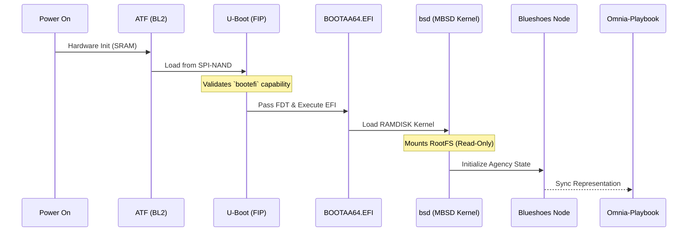

# MBSD: Minimal BSD for Edge Nodes 🛡️

**MBSD** (Minimal BSD) is a hyper-optimized OpenBSD port specifically designed for the Mediatek Filogic MT7981 (GL-MT3000 "Beryl AX"). It serves as the immutable, secure operating foundation for the **Timelabs** infrastructure ecosystem.

## 🌌 Ecosystem Integration

MBSD is not a standalone router firmware; it is the physical edge-layer primitive that powers the Timelabs network representation stack.

*   **[Blueshoes](../blueshoes):** MBSD provides the secure execution environment for Blueshoes durable capsules and non-negotiable state representations. The read-only MBSD architecture prevents unauthorized edge mutation, enforcing Blueshoes' Contradiction constraints.
*   **[Omnia-Playbook](../omnia-playbook):** Autonomous bootstrapping and semantic provisioning of the MBSD node are governed by the Omnia Playbook ruleset, ensuring zero-touch deployment that adheres to the global lexicon.
*   **[Rheknel](../rheknel):** Deep hardware telemetry (SPI-NAND metrics, GMAC counters, MT7976 radio state) is exposed via Rheknel's orchestration interfaces, maintaining continuous topological awareness.

---

## 🏗️ Architecture & Boot Flow

The MT7981 SoC utilizes a strict boot chain (BL2 -> FIP/U-Boot -> Kernel). MBSD safely integrates into this chain without modifying the low-level manufacturer calibration partitions.

## 🚀 Getting Started

**WARNING:** The GL-MT3000 uses a Mediatek proprietary U-Boot with specific `sysupgrade` / `UBI` constraints. **Do not** flash raw MBSD artifacts via the web UI.

1.  **Read the Architecture:** Understand the flash layout constraints in [`docs/ARCHITECTURE.md`](docs/ARCHITECTURE.md).
2.  **Telemetry & Backup:** Run [`scripts/backup_mt3000.sh`](scripts/backup_mt3000.sh) against the stock OpenWrt to extract calibration data and confirm EFI support.
3.  **RAM Boot:** Follow the safe telemetry runbook in [`docs/RUNBOOK.md`](docs/RUNBOOK.md) to perform a non-destructive RAM-only boot via UART.

---
*Developed by Timelabs NPO*
