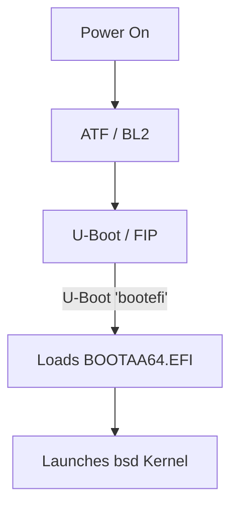

## MBSD: Minimal OpenBSD Port for MediaTek Filogic MT7981

**Status:** Alpha / Conceptual Stage (WIP)  
**Target Hardware:** GL.iNet GL-MT3000 ("Beryl AX")  
**Base OS:** OpenBSD 7.9-current (arm64)  

MBSD is an experimental, minimalist OpenBSD port tailored specifically for the MediaTek Filogic MT7981 SoC. The goal of the project is to provide a security-hardened, immutable base operating system for edge nodes within the Timelabs infrastructure, moving away from traditional Linux-based router distributions.

> [!WARNING]
> **Current Project Status:** This repository is currently a work-in-progress scaffolding. The codebase consists of initial driver stubs and boot configuration scripts. Active development is temporarily blocked pending physical UART access via USB-C adapter to capture raw hardware telemetry and debug the early console initialization.

---

## 🛠 Target Architecture & Boot Flow

Unlike standard Linux/OpenWrt deployments that rely on direct U-Boot to flat-image (uImage) kernel handoffs, MBSD follows the standard OpenBSD/arm64 boot protocol via EFI.

### Technical Specifications:

*   **The EFI Layer:** OpenBSD/arm64 strictly requires an EFI environment to initialize the kernel. U-Boot’s native `bootefi` implementation is utilized to execute the OpenBSD EFI bootloader (`BOOTAA64.EFI`) directly from the SPI-NAND flash without modifying low-level manufacturer calibration partitions.
*   **Storage & Immutability:** To ensure absolute edge-node integrity, MBSD is designed to run from a read-only root filesystem.
*   **The KARL vs. Immutability Tradeoff:** Running a read-only rootFS restricts Kernel Address Randomized Link (KARL) from saving a newly linked kernel back to disk on shutdown. MBSD addresses this embedded constraint by utilizing a dedicated, isolated writable staging partition specifically for the kernel re-linker, or optionally falling back to a static RAMDISK kernel where cryptographic immutability takes precedence over boot-to-boot randomization.

---

## 📁 Ecosystem Component Map

The project architecture relies on three primary subsystems (currently in design/stub phase):

1.  **[blueshoes](../blueshoes) (State Engine):** A hardened execution runtime for running lightweight virtualized workloads and ensuring strict state synchronization.
2.  **[omnia-playbook](../omnia-playbook) (Provisioning):** A zero-touch configuration utility designed for semantic node onboarding and automated cryptographic provisioning.
3.  **[rheknel](../rheknel) (Telemetry):** A low-level hardware telemetry daemon mapping SPI-NAND wearing metrics, GMAC counters, and MT7976 radio states directly to userland.
